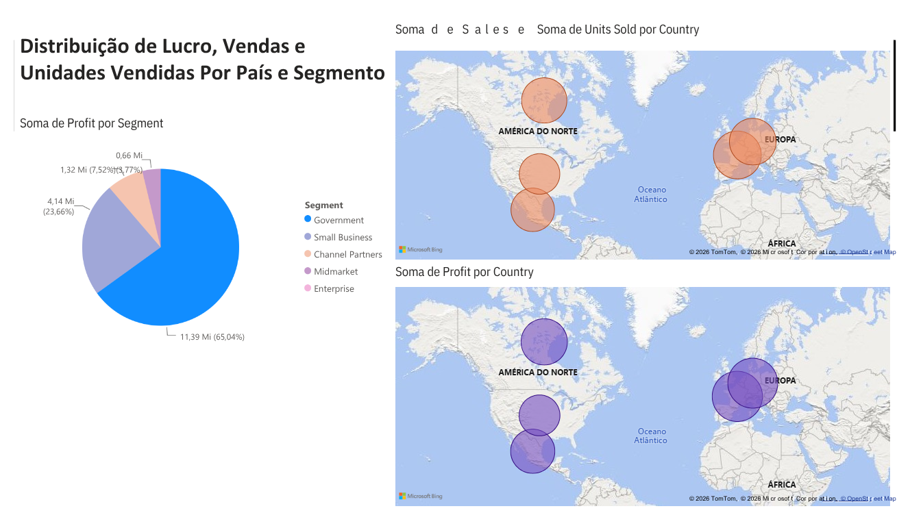

# 📊 Relatório de Vendas e Desempenho Global (Power BI)

Este repositório contém um projeto interativo desenvolvido em Power BI para análise de desempenho de vendas, lucratividade e volume de unidades vendidas por região, segmento de mercado e linha de produtos.

---

## 📌 Visão Geral do Projeto

O objetivo deste projeto é fornecer uma visão executiva e detalhada sobre a performance comercial global da organização, permitindo que gestores identifiquem os segmentos mais lucrativos, a sazonalidade das vendas e os países com maior representatividade no resultado geral.

---

## 📈 Principais Métricas (KPIs)

* **Soma Total de Vendas (*Sales*):** ~118,73 Mi
* **Total de Unidades Vendidas (*Units Sold*):** ~1,13 Mi
* **Evolução Temporal:** Análise comparativa entre os anos de 2013 e 2014.

---

## 📑 Estrutura do Relatório

O dashboard está dividido em três visões analíticas principais:

### 1. Relatório de Vendas por Produtos e Segmentos
* **Média de Preço de Venda (*Sale Price*) por Produto:** Destaque para produtos como *Paseo*, *VTT*, *Velo*, *Amarilla*, *Montana* e *Carretera*.
* **Soma de Vendas por Mês e Segmento:** Análise da evolução mensal dividida por canais como *Government*, *Small Business*, *Enterprise*, *Midmarket* e *Channel Partners*.
* **Segmentação Geográfica/Temporal:** Filtros laterais hierárquicos por Ano e Mês.

### 2. Relatório de Vendas e Lucratividade por País
* **Distribuição de Lucro (*Profit*) por País:** Gráfico de pizza destacando a participação de França (22,38%), Alemanha (21,79%), Canadá (20,89%), Estados Unidos (17,73%) e México (17,21%).
* **Volume de Vendas por País:** Gráfico de colunas comparando o total de faturamento por nação.
* **Sazonalidade do Lucro:** Gráfico de barras indicando os meses de maior e menor lucratividade ao longo de 2013 e 2014.

### 3. Análise Geográfica e Distribuição por Segmento
* **Mapeamento Global (*Bing Maps*):** Visualização espacial da distribuição do lucro na América do Norte e Europa.
* **Lucro por Segmento de Mercado:** Análise detalhada com destaque para o setor governamental (*Government*) como o maior gerador de margem (~65,04%).

---

## 🛠️ Tecnologias e Ferramentas Utilizadas

* **Power BI Desktop:** Construção dos visuais, filtros e layout interativo.
* **DAX (Data Analysis Expressions):** Criação de medidas agregadas de Vendas, Unidades Vendidas e Preço Médio.
* **Modelagem de Dados:** Estruturação de dados relacionais e tabelas temporais.
* **Bing Maps Integration:** Renderização espacial de métricas geográficas.
  
---

✍️ *Projeto desenvolvido como parte do curso de formação em Power BI.*
